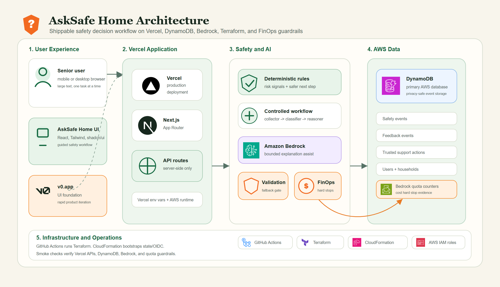

# AskSafe Home

AskSafe Home helps older adults pause, understand risk, and choose a safer next step when a call, message, website, video chat, or visitor leaves them feeling unsure.

The app is designed as a calm decision companion, not a generic chatbot. It guides people through one task at a time, uses large readable text, and keeps the safest next step clear.

## H0 Hackathon Winner

AskSafe Home won Open Innovation first prize in the H0: Hack the Zero Stack with Vercel v0 and AWS Databases Hackathon.

- Devpost project: [AskSafe Home](https://devpost.com/software/asksafe-home)
- Pitch video: [YouTube walkthrough](https://www.youtube.com/watch?v=mbEXnb-ODic)
- Technical article: [Building AskSafe Home with Vercel, v0, AWS DynamoDB, and Amazon Bedrock](https://builder.aws.com/post/3Fnwar87VeeS2xa0Lfe1UP06TQD_p/building-asksafe-home-with-vercel-v0-aws-dynamodb-and-amazon-bedrock-for-the-h0-hackathon)
- Live product: [asksafe-home.vercel.app](https://asksafe-home.vercel.app)
- Winning submission snapshot: `v1.0-h0-winner`

## Architecture



- Architecture overview: [docs/architecture/asksafe-home-architecture-overview.md](docs/architecture/asksafe-home-architecture-overview.md)

## What It Does

- Guides someone through an "I feel unsure" safety check
- Lets them describe what happened by typing or voice input
- Identifies common risk signals such as payment pressure, links, codes, personal details, app installs, and screen sharing
- Shows a plain-language result with risk level, safer next step, what not to do yet, why, and verification steps
- Provides official Australian help references
- Lets the user choose whether to involve someone they trust
- Supports read-aloud for result guidance

## Product Principles

- Reduce uncertainty before action
- One task at a time
- Large, readable, senior-friendly UI
- No pressure to share
- Data minimisation by default
- Official contact details over links or numbers supplied in suspicious messages
- Trusted support only when the user chooses it

## Current Status

This repository contains the AskSafe Home web app. The current version includes the guided safety-check UI, local deterministic safety logic, real email one-time-code setup sign-in, session-backed optional setup, encrypted trusted-contact persistence for user-initiated call/email actions, voice input, read-aloud support, official-help references, privacy-safe event persistence, and optional Bedrock-assisted result wording.

The current safety analysis is rule-based and deterministic. It is intended to make the product flow shippable while backend, persistence, and AI orchestration are added carefully.

## Post-H0 Product Hardening

The core safety check is intentionally usable without login.

The current `My setup` and trusted-support setup flow is optional. Email OTP sign-in exists only to remember setup and trusted-support preferences; anonymous safety checks remain available. Trusted contact email and phone values are saved only with explicit user consent, encrypted at rest, and shown back only to the authenticated setup owner for editing and user-initiated call/email actions.

Planned setup hardening:

- keep the core safety check available without an account
- keep real email OTP stable before considering additional channels
- persist lightweight user setup to `asksafe-home-prod-users`
- persist household or trusted-person setup to `asksafe-home-prod-households`
- keep trusted support user-controlled, with no automatic family monitoring
- support loading, editing, and deleting saved setup
- keep future trusted-person invitations, per-event sharing, and SMS support as explicit future designs
- document clearly what is saved, what is not saved, and what is not shared automatically

## Project Origin And Development Link

This is a [Next.js](https://nextjs.org) project bootstrapped with [v0](https://v0.app).

This repository is linked to a [v0](https://v0.app) project. You can continue developing by visiting the link below -- start new chats to make changes, and v0 will push commits directly to this repo. Every merge to `main` will automatically deploy.

[Continue working on v0 ->](https://v0.app/chat/projects/prj_ljiBkwnzAI2ce9pSOVKGKpymUJdw)

## Tech Stack

- Next.js App Router
- TypeScript
- React
- Tailwind CSS
- shadcn/ui-style components
- Vercel deployment
- AWS DynamoDB for privacy-safe event persistence
- Amazon Bedrock for optional bounded explanation assistance
- Terraform and GitHub Actions for AWS infrastructure

## Getting Started

Install dependencies, then run the development server:

```bash
pnpm install
pnpm dev
```

Open [http://localhost:3000](http://localhost:3000) in a browser.

If you use npm instead of pnpm:

```bash
npm install
npm run dev
```

## Scripts

```bash
pnpm dev
pnpm build
pnpm lint
pnpm test:rules
pnpm smoke:outcome-events -- https://asksafe-home.vercel.app
pnpm smoke:bedrock:analyze -- https://asksafe-home.vercel.app --expect-bedrock
```

In the current WSL development environment, the direct Node smoke command is the most reliable way to capture JSON output:

```bash
node --no-warnings --experimental-strip-types scripts/smoke-outcome-events.ts https://asksafe-home.vercel.app
node --no-warnings --experimental-strip-types scripts/smoke-bedrock-analyze.ts https://asksafe-home.vercel.app --expect-bedrock
```

The outcome smoke test verifies the deployed Vercel API can persist privacy-safe safety, feedback, and support events into DynamoDB.

## Safety Notice

AskSafe Home is not an emergency service, government service, legal adviser, financial adviser, or medical adviser.

Users should not enter passwords, one-time codes, full card numbers, or sensitive identity details.

If someone is in immediate danger in Australia, call `000`.

## Learn More

- [Next.js Documentation](https://nextjs.org/docs) - learn about Next.js features and API.
- [Learn Next.js](https://nextjs.org/learn) - an interactive Next.js tutorial.
- [v0 Documentation](https://v0.app/docs) - learn about v0 and how to use it.
