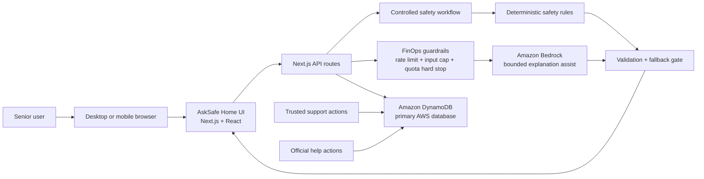
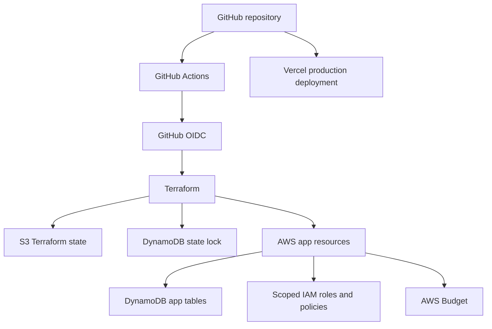

# AskSafe Home Architecture Overview

Status: current source of truth for the AskSafe Home product architecture.

This document consolidates the latest architecture for the production
`asksafe-home` repository. Earlier H0 architecture notes remain useful history,
but final submission and product planning should use this document first.

## Product Boundary

AskSafe Home is not a generic chatbot and not a universal scam detector. It is
a structured safety decision workflow that helps older adults pause, understand
risk signals, and choose a safer next step when a message, call, video chat, or
payment request feels uncertain.

The product should reduce:

- uncertainty
- fear
- loneliness
- decision pressure

AskSafe does not claim to prove whether a caller, message, voice, image, or
video is real. It helps the user avoid risky action and verify through safer
channels.

## Architecture Principles

- Senior-first: show the safer next step before complex analysis.
- Action-aware: identify what the other party wants the user to do.
- Structured: use a guided workflow, not an open-ended chatbot.
- Grounded: use trusted scam-safety patterns and explicit rules.
- Deterministic safety: rules own the safety structure and risk category.
- Bounded AI: Bedrock can improve wording but cannot weaken required warnings.
- Privacy-first: do not store sensitive raw messages by default.
- Consent-first support: trusted support is user-controlled.
- Full-stack proof: DynamoDB stores real privacy-safe product events.
- FinOps-aware: public AI calls need rate limits, input caps, quotas, and budget
  controls.

## Current Production Stack

- Frontend: Next.js App Router, React, TypeScript, Tailwind, shadcn/ui
- UI foundation: v0.app-assisted senior-friendly interface iteration
- Hosting: Vercel production deployment
- Runtime APIs: Next.js route handlers
- Database: Amazon DynamoDB
- AI assistance: Amazon Bedrock through a bounded server-side path
- Infrastructure: Terraform-managed AWS resources
- CI/CD and infrastructure workflow: GitHub Actions
- Security: scoped AWS IAM runtime role and GitHub Actions OIDC
- Cost controls: rate limits, input length caps, DynamoDB quota counters, AWS
  Budget, Bedrock quota hard stops

## Public Project Links

- Devpost project: [AskSafe Home](https://devpost.com/software/asksafe-home)
- Product walkthrough video:
  [YouTube](https://www.youtube.com/watch?v=mbEXnb-ODic)
- Technical article:
  [AWS Builder Center](https://builder.aws.com/post/3Fnwar87VeeS2xa0Lfe1UP06TQD_p/building-asksafe-home-with-vercel-v0-aws-dynamodb-and-amazon-bedrock-for-the-h0-hackathon)
- Live product: [asksafe-home.vercel.app](https://asksafe-home.vercel.app)
- Winning submission snapshot: `v1.0-h0-winner`

## High-Level Runtime Flow

## Controlled Safety Workflow

AskSafe uses controlled workflow roles. These are product workflow roles, not
unrestricted autonomous agents.

| Role | Responsibility | Boundary |
| --- | --- | --- |
| Context Collector | Normalizes user text, voice transcript, selected category, and action chips. | Does not decide risk. |
| Action Classifier | Identifies requested action: pay, click, share code, install app, share screen, give details, call back, or unsure. | Asks for more detail when action is missing. |
| Knowledge Retriever | Uses local trusted scam-safety pattern seeds and official guidance. | No heavy vector database is required for H0. |
| Deterministic Safety Reasoner | Owns risk level, risk signals, safer next step, hold-off actions, and verification steps. | Remains the source of safety structure. |
| Response Composer | Produces calm senior-friendly result wording. | Bedrock may assist wording but cannot remove warnings. |
| Event Recorder | Writes privacy-safe metadata and outcomes to DynamoDB. | Does not store sensitive raw text by default. |
| Trusted Support Coordinator | Handles user-chosen support actions and share summaries. | Never monitors or alerts without user choice. |

## DynamoDB Data Model

DynamoDB is the primary AWS database.

Production logical data areas:

- `asksafe-home-prod-events`: safety event metadata and Bedrock quota counters
- `asksafe-home-prod-feedback`: helpful/not-helpful feedback outcomes
- `asksafe-home-prod-support-events`: trusted support and official help actions
- `asksafe-home-prod-users`: lightweight user setup data
- `asksafe-home-prod-households`: household or trusted support setup data

Stored by default:

- event identifiers
- timestamps
- situation category
- intended action metadata
- risk level
- risk signal IDs
- support and feedback action metadata
- Bedrock operational outcome metadata
- quota counter items
- optional setup owner profile fields
- encrypted trusted contact email or phone only after explicit owner consent

Not stored by default:

- passwords
- one-time codes
- full card numbers
- full identity document details
- complete bank credentials
- raw sensitive messages
- plaintext trusted contact email or phone
- trusted contact details in safety, feedback, or support event payloads

## Bedrock Boundary

Bedrock is optional assistance, not the source of truth.

It may help with:

- senior-friendly explanation wording
- trusted support summary wording
- future screenshot or image observations if structured and validated

It must not:

- decide whether a person, caller, video, voice, or message is genuine
- become the sole risk classifier
- remove required safety warnings
- ask for sensitive details
- run for every keystroke or voice fragment
- bypass quota, validation, or deterministic fallback

Mandatory Bedrock guardrails:

- server-side only
- redacted structured payloads
- response shape validation
- safety invariant checks
- deterministic fallback
- timeout
- max input and output limits
- quota counters
- rate limiting
- AWS Budget awareness

## FinOps And Abuse Controls

Public AI features can create cost risk. AskSafe uses multiple controls:

- input length cap before analysis
- rate limiting on public routes
- Bedrock quota gate before prompt construction
- anonymous and registered user tier limits
- global daily and monthly quota counters
- DynamoDB transactional quota updates
- AWS Budget for spend visibility
- deterministic fallback when Bedrock is disabled or quota is exhausted

AWS Budgets are alerting controls. Runtime quota checks are the product hard
stop.

## Infrastructure Architecture

Bootstrap resources such as Terraform state storage, lock table, OIDC provider,
and GitHub Actions Terraform role are operational foundations. They should not
be destroyed as part of normal app resource cleanup.

## Official Help And Trusted Support

Official help is part of the workflow, not a claim that AskSafe is an official
authority.

AskSafe can show:

- Emergency `000`
- Scamwatch
- IDCARE
- Australian Cyber Security Centre

Trusted support is user-controlled:

- users may set up someone they trust
- saved trusted contact phone and email values are encrypted at rest and
  decrypted only server-side for the authenticated setup owner
- users choose whether to call, email, or copy a safety summary
- nothing is called, emailed, notified, or shared automatically
- no family monitoring or surveillance
- legacy support codes do not authorize access and are no longer shown or
  created in active UI

Future trusted-contact invitations, per-event safety-summary sharing, and SMS
support need explicit consent, revocation, abuse, privacy, accessibility, and
cost designs before implementation.

## Submission Diagram Source

The competition diagram source is:

- `docs/assets/architecture/asksafe-home-architecture.png`
- `docs/assets/architecture/asksafe-home-architecture.svg`
- `docs/assets/architecture/asksafe-home-architecture.drawio`
- `docs/competition/h0-architecture-diagram.md`
- `docs/competition/h0-architecture-evidence-checklist.md`

Those files are optimized for submission and visual explanation. This file is
the fuller product architecture overview.

## Known Future Extensions

Future work may include:

- richer guided clarification
- screenshot or image review
- real optional setup persistence with email or phone OTP, or magic-link sign-in
- DynamoDB-backed user setup and household or trusted-person setup
- deeper consent-managed trusted support workflow
- more official verification pathways
- accessibility testing with older adults
- partner workflows for banks, councils, aged care providers, and community
  organizations

Future extensions should preserve the same product boundary: AskSafe helps users
pause and verify safely; it does not claim certainty about real versus fake.

The core safety check should remain usable without an account. Account setup is
for optional personalization and trusted support continuity, not a gate in front
of urgent safety guidance. Trusted support should remain user-controlled and
should not become automatic family monitoring.

Detailed setup persistence design:

- `docs/product/optional-setup-persistence-design.md`
