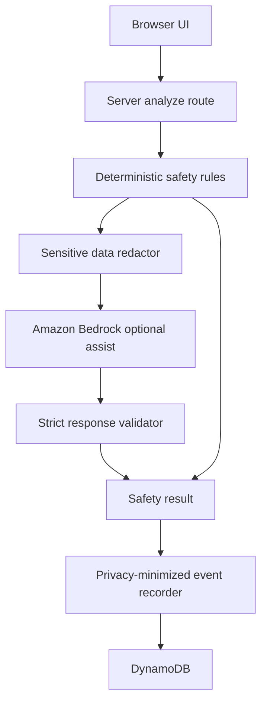

# Bedrock AI Orchestration And FinOps Guardrails

## Purpose

AskSafe Home should use AI only when it reduces uncertainty, loneliness, fear, or decision pressure for seniors.

The product already has deterministic safety rules, trusted scam pattern seeds, result signals, official help, and privacy-minimized DynamoDB event persistence. Bedrock should strengthen that workflow without turning AskSafe Home into a generic chatbot, black-box scam detector, or expensive always-on model surface.

This design defines how AskSafe Home can add Amazon Bedrock safely, cheaply, and reversibly.

## Product Boundary

Bedrock is an optional assistant layer.

It may help with:

- improving senior-friendly wording from an existing rules-derived result
- creating a short share summary for trusted support
- translating or simplifying result copy in a controlled way
- future screenshot or image observation, if the output is structured and validated

It must not:

- be the sole risk classifier
- decide whether a person, caller, voice, video, or message is genuine
- remove required safety warnings from the rules engine
- ask the user for sensitive details
- store or expose AWS credentials in the browser
- run for every keystroke, voice fragment, or chat turn

The deterministic rules engine remains the source of safety structure:

- risk level
- risk signals
- safer next step
- what not to do yet
- verification steps
- official help recommendations

## Default-Off Runtime Controls

Bedrock should be disabled unless all required controls are explicitly configured.

Recommended environment variables:

- `ENABLE_BEDROCK_EXPLANATION=false`
- `BEDROCK_MODEL_ID=`
- `BEDROCK_MAX_INPUT_CHARS=1800`
- `BEDROCK_MAX_OUTPUT_TOKENS=500`
- `BEDROCK_TIMEOUT_MS=4500`

Runtime rule:

If `ENABLE_BEDROCK_EXPLANATION` is not exactly `true`, AskSafe Home must use the deterministic rules result only.

If Bedrock is enabled but the model id, AWS runtime credentials, model access, timeout, response shape, or validation fails, AskSafe Home must fall back to the deterministic rules result without blocking the user.

## Architecture



Browser code never calls Bedrock directly. Bedrock calls happen only in server-side code after deterministic analysis has already produced a usable result.

## Orchestration Flow

1. The user completes the guided safety check.
2. The existing analyzer produces a deterministic result.
3. The server checks whether Bedrock is enabled.
4. The server builds a minimal model payload from structured fields only.
5. The server redacts obvious sensitive tokens before sending anything to Bedrock.
6. Bedrock returns strict JSON for allowed copy fields only.
7. The server validates shape, length, and required warnings.
8. If validation passes, safe wording improvements are applied.
9. If anything fails, the original deterministic result is returned.
10. Event persistence records metadata such as `bedrockUsed`, `bedrockOutcome`, and model family, without raw model payloads.

## Minimal Model Payload

Send only what Bedrock needs to improve wording.

Allowed fields:

- category
- selected request chips
- intended action
- risk level from rules
- risk signal IDs
- trusted source IDs
- deterministic safer next step
- deterministic do-not-do-yet items
- deterministic verification steps
- short redacted situation summary when necessary
- user language preference when available

Avoid sending:

- passwords
- one-time codes
- full card numbers
- bank account credentials
- complete identity document numbers
- full addresses
- raw conversation transcripts by default
- trusted person's contact details
- support codes unless specifically needed for a support-code workflow, which should not be needed for explanation polish

## Redaction Rules

Before a model call, apply simple deterministic redaction to likely sensitive values.

Examples:

- replace one-time codes with `[one-time code removed]`
- replace long card-like digit sequences with `[card number removed]`
- replace email addresses with `[email removed]` unless the email domain itself is relevant
- replace phone numbers with `[phone number removed]`
- replace Medicare, passport, licence, and account-number-like values with `[identity detail removed]`

Redaction is not a guarantee. The product should still ask users not to enter sensitive details and should avoid sending raw text unless there is a strong product reason.

## Prompt Contract

The Bedrock prompt should be narrow and boring on purpose.

It should say:

- You are helping rewrite a rules-derived safety result for an older adult.
- Do not decide whether the situation is real or fake.
- Do not change the risk level.
- Do not remove warnings.
- Do not ask for passwords, one-time codes, banking details, or identity documents.
- Use calm, plain language.
- Return only valid JSON matching the schema.

Allowed output shape:

```json
{
  "saferNextStep": "string",
  "why": "string",
  "verificationSteps": ["string", "string", "string"],
  "trustedSupportSummary": "string"
}
```

The server must reject output that adds unsupported claims, removes mandatory warnings, exceeds length limits, or fails JSON parsing.

## Mandatory Safety Invariants

These warnings are controlled by rules and must survive any Bedrock assist when relevant:

- Do not send money yet.
- Do not click links from the message.
- Do not share passwords, PINs, or one-time codes.
- Do not install apps because an unexpected caller asked.
- Do not share your screen with an unexpected caller.
- Use official contact details found separately.
- In immediate danger, call `000` in Australia.

Bedrock can make wording clearer, but it cannot weaken these instructions.

## FinOps Guardrails

Bedrock use should be rare, bounded, and observable.

Controls:

- default off in all environments
- model ARN allowlist in Terraform through `bedrock_model_arns`
- no Bedrock IAM permission unless model ARNs are configured
- small input payloads built from structured analysis, not full chat history
- strict max input characters
- strict max output tokens
- short server timeout
- no streaming for the first implementation unless there is a clear UX need
- no calls for empty, low-information, or repeated input
- no calls during every voice recognition interim transcript
- no calls in local development unless explicitly enabled

Operational safeguards:

- AWS Budgets alerts before enabling Bedrock
- manual model access request only for the chosen region
- record model family and outcome metadata, not raw prompt or completion text
- review CloudWatch or provider cost reports during testing
- disable the environment flag immediately if cost or output quality looks wrong

Recommended first model posture:

Use the smallest Bedrock model that produces reliable senior-friendly rewrite quality for short structured payloads. Prefer cheaper models for explanation polish. Reserve larger multimodal models for future image-observation experiments only after the text path proves useful.

Current production smoke-test candidate:

- `anthropic.claude-haiku-4-5-20251001-v1:0`

This model is selected for low-latency explanation polish, not for autonomous
classification. If AWS requires an inference profile for this model, use the
approved inference profile ID as `BEDROCK_MODEL_ID` and allowlist its ARN in the
runtime IAM policy.

## Persistence Metadata

When Bedrock is attempted, persist only privacy-minimized operational metadata.

Suggested event fields:

- `bedrockEnabled`
- `bedrockUsed`
- `bedrockOutcome`: `disabled`, `success`, `timeout`, `invalid_response`, `runtime_error`, or `not_configured`
- `bedrockModelFamily`
- `bedrockLatencyMs`
- `bedrockInputCharsBucket`: for example `0-500`, `501-1000`, or `1001-1800`

Do not persist raw prompts, raw completions, or sensitive user text by default.

## Failure Modes

| Failure | User experience | Logged metadata |
| --- | --- | --- |
| Bedrock disabled | deterministic result appears normally | `bedrockOutcome=disabled` |
| Missing model config | deterministic result appears normally | `bedrockOutcome=not_configured` |
| AWS access denied | deterministic result appears normally | `bedrockOutcome=runtime_error` |
| Timeout | deterministic result appears normally | `bedrockOutcome=timeout` |
| Invalid JSON | deterministic result appears normally | `bedrockOutcome=invalid_response` |
| Safety invariant violation | deterministic result appears normally | `bedrockOutcome=invalid_response` |

The user should not see technical Bedrock errors during a safety check.

## Testing Strategy

Unit tests should cover:

- disabled mode never calls Bedrock
- missing config falls back to deterministic rules
- redaction removes obvious sensitive tokens
- timeout falls back
- invalid JSON falls back
- responses that remove required warnings are rejected
- successful output can only replace allowed copy fields
- persistence metadata records Bedrock outcome without raw prompt text

Integration smoke tests should cover:

- production route still works with Bedrock disabled
- production route works with Bedrock enabled only after model access, env vars, and IAM allowlist are configured
- DynamoDB event metadata records `bedrockUsed` accurately

## Implementation Cutline

P5.0 was design only.

Implementation is proceeding in small steps:

1. Add server-side Bedrock config parsing and disabled-mode tests. Done in P5.1.
2. Add redaction helper and tests. Done in P5.1.
3. Add Bedrock client wrapper with timeout and fallback tests. Done in P5.2.
4. Add strict response validation and safety invariant tests. Done in P5.3.
5. Add optional analyze-route integration behind `ENABLE_BEDROCK_EXPLANATION`. Done in P5.4.
6. Add production smoke-test documentation and a CLI smoke path after enabling Bedrock in a controlled environment. Done in P5.6.

Do not add screenshot analysis, generic chat, family monitoring, or autonomous agent behavior in the first Bedrock implementation.

P5.2 adds only the server-side Bedrock Runtime wrapper. It does not connect
Bedrock to the frontend, result page, or production analyze route. It does not
let Bedrock set risk level, remove rule-derived warnings, or decide whether a
situation is genuine.

P5.3 adds response validation for model-assisted explanation text. It accepts
only the narrow JSON shape defined in this document, rejects unsupported fields
and oversized copy, and rejects output that contradicts rule-derived safety
warnings. It still does not connect Bedrock to the frontend, result page, or
production analyze route.

P5.4 adds a server-side analyze route and handler that can call the optional
Bedrock explanation assist after deterministic analysis. The handler preserves
the rule-derived risk level, headline, do-not-do-yet warnings, risk signals,
scam type ids, and source ids. Bedrock can only replace allowed explanation
copy after validation. The browser UI still uses the existing local flow until
the team intentionally switches it to the server route.

P5.5 switches the browser safety check to the server analyze route through a
small client wrapper. If `/api/analyze` fails, returns a non-OK response, or
returns a malformed payload, or takes too long, the wrapper falls back to the
existing local deterministic analysis so the user still receives a safety
result.

P5.6 adds a production smoke-test path for the Bedrock-assisted analyze route.
It does not add a new public Bedrock endpoint. The smoke path posts a synthetic,
sanitized test case to the existing `/api/analyze` route and verifies the
response shape, high-risk deterministic structure, and optional Bedrock outcome.
When run with `--expect-bedrock`, the smoke test requires
`bedrock.used=true` and `bedrock.outcome=success`.
