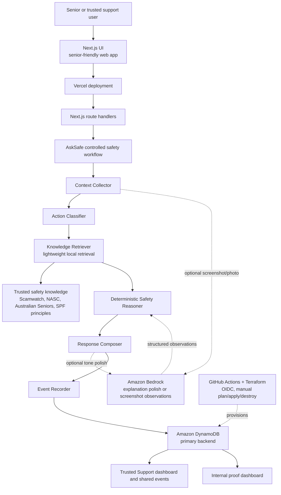
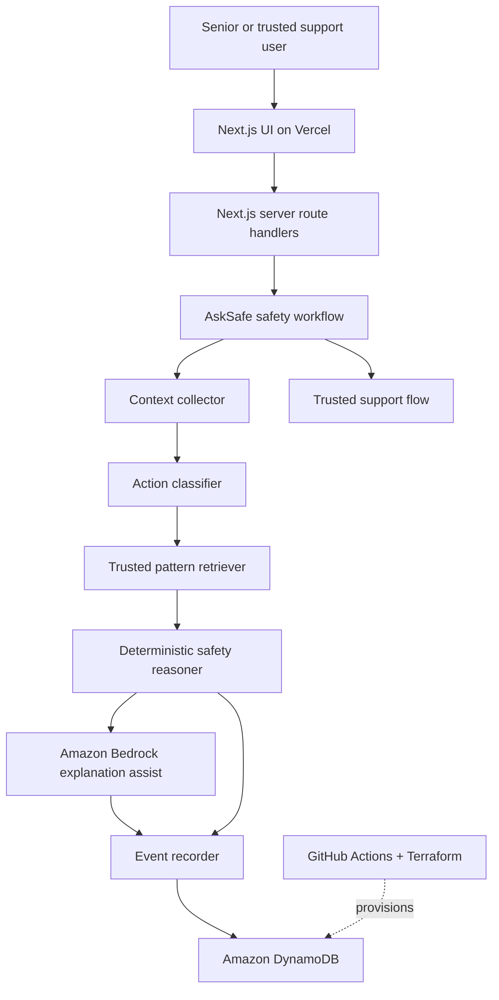

# Cloud And AI Foundation Design

## Purpose

AskSafe Home currently has a shippable web experience with local, deterministic
safety analysis. The next product step is to add an AWS foundation that can be
deployed safely, audited clearly, and extended toward Bedrock-assisted guidance
without weakening the senior-safety workflow.

This foundation should answer one product question:

> How does cloud and AI reduce uncertainty, loneliness, fear, or decision
> pressure for seniors?

For this phase, cloud and AI should help AskSafe remember safety checks, support
trusted sharing, and improve plain-language explanations. They should not turn
AskSafe into a generic chatbot or a black-box scam detector.

## Current State

The app repository contains:

- Next.js App Router web app.
- Local rule-based safety analyzer.
- Trusted scam pattern seeds.
- Result signals workflow.
- Trusted support setup UI.
- Mock one-time-code sign-in flow.
- Vercel deployment from `main`.

The app repository does not yet contain:

- Active AWS infrastructure.
- Terraform app resources.
- GitHub Actions OIDC deployment workflow.
- DynamoDB tables.
- Bedrock runtime integration.
- Server-side persistence or AI orchestration API.

An earlier infrastructure branch in the broader AskSafe workspace created useful
bootstrap scaffolding. Its architecture is valuable, but the defaults still refer
to `asksafe-h0`. The official product repository should use `asksafe-home`
naming unless a temporary H0 environment is intentionally created.

## Architecture Principles

- Senior-first: show the safer next step before complex analysis.
- Action-aware: identify what the other party wants the user to do before
  judging risk.
- Grounded: use trusted scam-safety patterns and explicit rules.
- Agentic but controlled: each workflow stage has a clear input and output.
- Privacy-first: do not store sensitive raw messages by default.
- Consent-first trusted support: the user chooses when to involve a trusted
  person.
- Full-stack proof: AWS should show real persistence and deployability, not only
  a UI mock.
- Bedrock where useful: Bedrock may assist explanation quality, but deterministic
  logic decides the safety structure.

## Recommended Architecture

Use a two-layer infrastructure model.

### Layer 1: Bootstrap Infrastructure

Bootstrap is created once with CloudFormation from an already-secured AWS admin
session.

Bootstrap resources:

- S3 bucket for Terraform remote state.
- DynamoDB table for Terraform state locking.
- GitHub Actions OIDC provider for `token.actions.githubusercontent.com`.
- Scoped IAM role for GitHub Actions Terraform runs.

The bootstrap stack must be outside the normal app Terraform destroy path. The
state bucket, state lock table, OIDC provider, and Terraform role are operational
foundations, not app resources.

Default bootstrap naming:

- GitHub org: `sailing-together`
- GitHub repo: `asksafe-home`
- GitHub environment: `aws-infra`
- AWS region: `ap-southeast-2`
- State key: `asksafe-home/prod/terraform.tfstate`
- Project name: `asksafe-home`
- Environment: `prod`

If the team wants an H0-only AWS environment, use `environment = "h0"` while
keeping the repository and project naming aligned with `asksafe-home`.

### Layer 2: App Infrastructure

App resources are managed by Terraform and deployed through GitHub Actions.

Initial app resources:

- DynamoDB table for users.
- DynamoDB table for households or support groups.
- DynamoDB table for safety check events.
- DynamoDB table for trusted support events.
- DynamoDB table for feedback or outcome signals.
- IAM policy surface for server-side app runtime access.
- Bedrock invocation permission for the chosen model.

The app Terraform may be destroyed after competition screenshots or demo evidence
are captured. Destroy must not remove the bootstrap stack.

## System Flow

### Full Target Architecture

This diagram preserves the broader AskSafe target architecture while using the
`asksafe-home` product repository as the default implementation home.

### P3 Implementation Flow

The first P3 implementation should prove the deployable backend and Bedrock
boundary before building every dashboard route.

## Agentic Safety Workflow

AskSafe should stay a structured workflow, not a free-form assistant.

### Controlled Agent Roles

Each workflow role has a narrow contract. These are product workflow roles, not
autonomous agents with unrestricted tools.

| Role | Input | Output | Boundary |
| --- | --- | --- | --- |
| Context Collector | user text, voice transcript, selected category, selected action chips, optional image observations | normalized situation context | does not decide risk |
| Action Classifier | normalized situation context | intended action such as pay, click, share code, install app, call back, share screen, personal details, or unsure | asks for clarification when action is missing |
| Knowledge Retriever | intended action, risk signals, source seed IDs | compact trusted patterns | uses local knowledge seeds before any heavier retrieval |
| Deterministic Safety Reasoner | context, action, trusted patterns | risk level, safer next step, do-not-do-yet items, verification steps, risk signals | owns the safety structure and final risk category |
| Response Composer | structured safety result, user language, tone constraints | calm senior-friendly result copy | may use Bedrock for wording, but cannot remove required warnings |
| Event Recorder | validated result metadata and user consent flags | privacy-minimized DynamoDB records | does not store sensitive raw text by default |
| Trusted Support Coordinator | user-chosen support action and event summary | support event, shareable summary, dashboard record | never alerts or monitors without consent |

Workflow stages:

1. Collect the user's text, voice transcript, selected category, selected action
   chips, role, and language.
2. Redact obvious sensitive tokens before model calls or persistence.
3. Detect intended action: pay, click, call back, share code, install app, share
   screen, give personal details, reply, ignore, or unsure.
4. Retrieve compact trusted patterns from local knowledge seeds.
5. Run deterministic risk reasoning.
6. Optionally ask Bedrock to polish a senior-friendly explanation.
7. Return a structured result.
8. Store a privacy-minimized event in DynamoDB when logging is enabled.
9. Store a consent-first trusted support event only when the user chooses to
   involve someone.
10. Collect lightweight feedback when appropriate.

## Lightweight Knowledge Retrieval

Use lightweight local retrieval for the first production-shaped version.

Knowledge sources:

- Scamwatch scam types and Stop. Check. Protect guidance.
- National Anti-Scam Centre reports and alerts.
- Australian Seniors scam-report patterns.
- Scams Prevention Framework prevention principles.
- AskSafe tested scenarios.

Why not a vector database yet:

- The knowledge base is compact.
- Intended action and explicit safety rules matter more than fuzzy semantic
  matching for this product stage.
- DynamoDB is the required AWS database proof.
- A vector stack would add operational risk before it reduces senior uncertainty.

Future options:

- OpenSearch Serverless.
- Aurora PostgreSQL with pgvector.
- A local vector store for experimentation outside the deployed product.

## Application Routes And API Targets

The current app does not need every target route immediately, but the cloud
foundation should support the full product shape from the original architecture.

Target pages:

- `/` home and product entry.
- `/onboarding` role selection and lightweight registration.
- `/check` guided safety check.
- `/result/[eventId]` optional persisted result view.
- `/support` trusted support dashboard.
- `/family` trusted support dashboard alias, if that label tests better with
  families.
- `/dashboard` internal proof dashboard.

Current UI note:

- The current setup modal may continue to cover lightweight onboarding until a
  dedicated route is needed.

Target API routes:

- `POST /api/register`
- `POST /api/households`
- `POST /api/households/join`
- `POST /api/analyze`
- `POST /api/analyze-image`
- `POST /api/feedback`
- `POST /api/support-event`
- `GET /api/support/events`
- `GET /api/dashboard`

Implementation cutline:

- Keep `/api/analyze`, DynamoDB event persistence, feedback, and trusted support.
- Keep `/api/analyze-image` in the target architecture, but defer implementation
  unless screenshot/photo understanding works end to end through Bedrock.
- Cut proof dashboard polish before cutting the core safety workflow.

## GitHub Actions Deployment

Use a manually triggered Terraform workflow.

Workflow properties:

- `workflow_dispatch` only.
- Inputs: `plan`, `apply`, `destroy`.
- `permissions.id-token: write`.
- `permissions.contents: read`.
- Protected GitHub environment: `aws-infra`.
- Required reviewers for `apply` and `destroy`.
- `aws-actions/configure-aws-credentials` assumes the CloudFormation-created IAM
  role through OIDC.
- Terraform backend config is passed at init time from GitHub repository
  variables.

Repository variables:

- `AWS_REGION`
- `TF_STATE_BUCKET`
- `TF_STATE_KEY`
- `TF_LOCK_TABLE`
- `TF_PROJECT_NAME`
- `TF_ENVIRONMENT`
- `BEDROCK_MODEL_ID`

Repository secrets:

- `AWS_GITHUB_ACTIONS_ROLE_ARN`

Do not store long-lived AWS access keys in GitHub, Vercel, v0.app, or local
project files.

## Vercel Runtime Configuration

Vercel should receive only runtime configuration, not Terraform credentials.

Expected environment variables:

- `AWS_REGION`
- `ASKSAFE_USERS_TABLE`
- `ASKSAFE_HOUSEHOLDS_TABLE`
- `ASKSAFE_EVENTS_TABLE`
- `ASKSAFE_FEEDBACK_TABLE`
- `ASKSAFE_SUPPORT_EVENTS_TABLE`
- `ENABLE_BEDROCK_EXPLANATION`
- `BEDROCK_MODEL_ID`
- `ENABLE_EVENT_LOGGING`

Local development may use:

- `ASKSAFE_USE_LOCAL_MOCKS=true`

The app should still work without AWS or Bedrock env vars by falling back to the
local deterministic analyzer.

## Runtime Bedrock Integration

Bedrock should be called only from a server-side route or server action.

The browser should never receive AWS credentials and should not call Bedrock
directly.

Recommended runtime flow:

1. User describes the situation.
2. Local rule analyzer creates structured safety output:
   - risk level
   - safer next step
   - what not to do yet
   - verification steps
   - risk signals
   - source IDs
3. Server API optionally sends a minimal, redacted payload to Bedrock.
4. Bedrock improves wording and explanation within strict output constraints.
5. Server validates the response shape.
6. If Bedrock fails, times out, or returns invalid output, the app uses the local
   rules result.

Original workflow alignment:

- Collect the user's text, description, screenshot/photo observations, selected
  role, and language.
- Redact obvious sensitive tokens before persistence.
- Detect intended action: pay, click, call, share code, install app, reply,
  ignore, or unsure.
- Retrieve compact trusted patterns.
- Apply SPF-informed product principles: prevent, detect, report, disrupt, and
  respond.
- Run deterministic risk reasoning.
- Optionally ask Bedrock to polish a senior-friendly explanation or interpret
  image content.
- Return structured result.
- Store anonymized event in DynamoDB.
- Collect feedback.
- Store a consent-first trusted support event if the user chooses to involve a
  trusted person.

The rule engine remains the source of safety structure. Bedrock may improve
plain-language explanation, but it must not remove core warnings such as do not
send money, do not share one-time codes, do not install remote access tools, and
verify through official channels.

## Data Minimisation

Store the minimum data needed to support product learning and trusted handoff.

Recommended persisted event shape:

- `eventId`
- `createdAt`
- `anonymousUserId` or signed-in user reference
- `householdId`, if the user has joined one
- `category`
- `inputMode`: text, voice transcript, screenshot observation, or photo
- selected request chips
- intended action
- normalized risk level
- risk signal IDs
- source IDs
- recommended action summary
- `rawTextStored`: false by default
- whether the result was shared
- feedback outcome, if provided

Avoid storing:

- passwords
- one-time codes
- full card numbers
- full identity documents
- raw bank credentials
- unnecessary full message text

If raw user text is stored for product debugging, it should be temporary,
explicitly marked, and easy to disable before public demo.

## DynamoDB Data Model

Use environment-specific names with the `asksafe-home-${environment}` prefix.

Logical table names from the original architecture:

- `AskSafeUsers`
- `AskSafeHouseholds`
- `AskSafeEvents`
- `AskSafeFeedback`
- `AskSafeSupportEvents`

Terraform physical names should map those logical tables to environment-specific
names such as `asksafe-home-prod-users` or `asksafe-home-h0-users`.

Recommended initial tables:

### Users

- Table: `${name_prefix}-users`
- Partition key: `userId`
- Fields: role, displayName, email hash or sign-in reference, createdAt,
  languagePreference.
- Roles: `senior`, `trusted_support`, or `founder`.

### Households

- Table: `${name_prefix}-households`
- Partition key: `householdId`
- Fields: supportCode, createdByUserId, createdAt, memberUserIds.

### Events

- Table: `${name_prefix}-events`
- Partition key: `eventId`
- Suggested GSIs:
  - `householdId-createdAt-index`
  - `createdByUserId-createdAt-index`
  - `riskLevel-createdAt-index`
- Fields: householdId, createdByUserId, createdAt, inputMode, intendedAction,
  riskLevel, riskSignals, sourcePatternIds, recommendedAction, rawTextStored,
  summary, bedrockUsed.

### Feedback

- Table: `${name_prefix}-feedback`
- Partition key: `feedbackId`
- Fields: eventId, userId, helpful, comment, createdAt.

### Support Events

- Table: `${name_prefix}-support-events`
- Partition key: `supportEventId`
- Fields: eventId, householdId, createdByUserId, supportType, createdAt.

### Official Help Metadata

Official help is part of the safety workflow. It should guide users to trusted
channels without pretending AskSafe is an official authority.

Recommended event metadata:

- `officialHelpShown`
- `officialHelpReason`: money, identity, account_access, cyber_incident,
  personal_safety, or report_scam
- `officialHelpActions`: shown actions such as `emergency_000`,
  `scamwatch_report`, `idcare_1800_595_160`, or `acsc_report_cyber`
- `officialHelpClicked`, if the user clicks an official help action

UI rules:

- Show official help collapsed for low and medium risk unless the user asks for
  it.
- Show official help expanded for high risk or identity/account compromise.
- Always remind users not to use phone numbers or links from the suspicious
  message.

## Bedrock Model Choice

Use an environment variable for the model ID so the app can change models without
code edits.

Preferred product uses:

- Screenshot/photo understanding: turn image content into structured
  observations.
- Explanation polish: convert structured safety output into calm
  senior-friendly wording.

Initial recommendation:

- Start with a cost-conscious Anthropic Claude model available through Amazon
  Bedrock in the chosen region.
- Keep the prompt narrow: rewrite or enrich a rules-derived safety result, do not
  independently decide truth or fraud.
- Return strict JSON that matches the existing result contract.

Rules:

- Do not let Bedrock be the sole risk classifier.
- Do not send unnecessary personal data.
- Redact obvious secrets before model calls when possible.
- Keep a deterministic fallback for local development and AWS outages.
- Clearly store whether Bedrock was used for an event.

The product should not claim that Bedrock verifies whether a message, caller,
voice, video, or person is genuine.

## Security Boundaries

- GitHub Actions assumes AWS role through OIDC.
- Trust policy must restrict the `sub` claim to
  `repo:sailing-together/asksafe-home:environment:aws-infra`.
- Terraform role should be scoped to app resources and Terraform state access.
- App runtime permissions should be separate from Terraform permissions.
- Runtime IAM should allow only:
  - specific DynamoDB table reads/writes needed by the app
  - `bedrock:InvokeModel` and optionally `bedrock:InvokeModelWithResponseStream`
    for the configured model
- Do not give Vercel or the app broad account-admin permissions.

Product privacy boundaries:

- Do not store passwords, card numbers, one-time codes, complete bank account
  details, or full private identifiers.
- Do not store raw scam messages by default.
- Store summaries, risk signals, intended action, source pattern IDs, result
  metadata, and trusted-support consent events.
- Keep trusted support consent-first.
- Do not commit AWS credentials or Terraform state.

Product boundaries:

- AskSafe Home is not a generic chatbot.
- AskSafe Home is not a deepfake detector.
- AskSafe Home is not a legal or financial adviser.
- AskSafe Home is not an official government service.
- AskSafe Home is not a family surveillance tool.
- AskSafe Home is a guided safety decision companion for uncertainty, fear,
  loneliness, and decision pressure.

## AWS Account Safety Checklist

Before creating application resources:

- Enable MFA on the AWS root account.
- Confirm the root account has no access keys.
- Enable MFA on the admin IAM user.
- Configure AWS Budgets alerts before using Bedrock.
  Recommended thresholds: 5 USD, 10 USD, and 25 USD.
- Redeem any approved AWS promotional credits before heavier testing.
- Choose one primary region.
  Recommended default: `ap-southeast-2`, unless required Bedrock model access is
  unavailable there.
- Request Bedrock model access in the chosen region.
- Delete or rotate any temporary bootstrap access keys after OIDC works.

## Demo And Evidence Requirements

For competition or stakeholder review, capture evidence before destroying app
resources:

- Vercel app URL.
- Vercel project link.
- Vercel Team ID when needed for submission.
- Vercel deployment screen.
- GitHub repository and workflow run.
- Terraform plan/apply run.
- DynamoDB tables and sample records.
- Safety check result.
- Trusted support or family dashboard.
- Bedrock model access or invocation evidence, if enabled.
- Architecture diagram.
- Product screenshots for desktop and mobile.
- Short demo showing safety check, result, official help, and trusted support.
- Testing instructions and access credentials if any submitted flow is private.
- Confirmation that the app remains available through the judging period when
  used for a competition submission.

Submission story:

- A senior receives a message, call, or online request that creates pressure.
- They are not sure whether it is safe.
- AskSafe asks what the other party wants them to do.
- AskSafe checks trusted patterns and deterministic rules.
- AskSafe gives a safer next step, verification guidance, and official help.
- The user can choose trusted support without automatic monitoring.

Closing product promise:

> No one has to decide alone.

Judging-oriented proof:

- Technical implementation: Vercel deployment, DynamoDB primary backend, route
  handlers, clean API boundaries, and GitHub Actions/Terraform evidence where
  available.
- Design: senior-friendly typography, large touch targets, minimal choices,
  readable result structure, and consent-first trusted support.
- Impact: a real decision-under-pressure workflow for seniors and families.
- Originality: source-backed safety workflow rather than a generic chatbot,
  deepfake detector, or real/fake classifier.

Local development and fallback:

- `ASKSAFE_USE_LOCAL_MOCKS=true` may be used only for local development.
- Local mock mode must not be presented as the production backend.
- The deployed product should use DynamoDB for user, household, event, feedback,
  or support records once the cloud foundation is active.

## Implementation Slices

### Roadmap Alignment

The original target roadmap is preserved as a product direction, with P3 focused
on the cloud and AI foundation needed to unlock it.

P0 shippable product:

- Vercel deployment.
- DynamoDB tables.
- Registration and household or trusted-support join.
- Guided safety check.
- Structured risk result.
- Consent-first trusted support.
- Trusted support dashboard.
- Internal proof dashboard.
- Bedrock image or explanation path if time allows.

P1 stronger safety product:

- Better action classifier.
- Expanded trusted knowledge seed.
- More test scenarios.
- More accessible mobile UX.
- Contact verification checklist.
- Safer trusted contact management.

P2 production direction:

- Real authentication.
- Multi-language support.
- Consent-managed trusted contacts.
- Report/export flow.
- Observability and audit trails.
- Stronger privacy controls.
- Optional vector retrieval if the knowledge base grows.

### P3.1 Bootstrap Foundation

Add:

- `infrastructure/cloudformation/terraform-bootstrap.yml`
- `infrastructure/README.md`
- Terraform state ignore rules

Purpose:

- Create S3 backend, DynamoDB lock table, GitHub OIDC provider, and Terraform
  deploy role.

Acceptance:

- Template names target `asksafe-home`, not `asksafe-h0`.
- IAM trust policy uses GitHub environment-bound OIDC subject.
- AWS account safety checklist is documented before bootstrap.
- State bucket and lock table have retain policies.
- README explains manual bootstrap and GitHub variables.

### P3.2 Terraform App Infrastructure

Add:

- `infrastructure/terraform/versions.tf`
- `infrastructure/terraform/providers.tf`
- `infrastructure/terraform/variables.tf`
- `infrastructure/terraform/main.tf`
- `infrastructure/terraform/backend.tf.example`

Purpose:

- Manage app DynamoDB tables and runtime IAM surfaces.

Acceptance:

- Terraform validates locally or in GitHub Actions.
- App resources use `asksafe-home-${environment}` naming.
- DynamoDB tables use pay-per-request billing.
- Table outputs map directly to Vercel runtime env vars.
- Outputs expose table names needed by runtime configuration.

### P3.3 GitHub Actions Terraform Workflow

Add:

- `.github/workflows/terraform.yml`

Purpose:

- Run manual Terraform plan, apply, and destroy through GitHub OIDC.

Acceptance:

- Workflow uses `id-token: write`.
- Workflow uses protected `aws-infra` environment.
- Workflow does not require AWS access keys.
- `plan` runs before `apply` and `destroy`.
- Region defaults are consistent across all AWS and Terraform steps.

### P3.4 Bedrock Analysis API

Add:

- server-side API route for safety analysis.
- Bedrock client wrapper.
- rules-first prompt and response validation.
- graceful fallback to local rules.
- optional image-observation pathway only after text analysis is stable.

Purpose:

- Improve explanation quality while keeping deterministic safety guardrails.

Acceptance:

- The app still works without Bedrock env vars.
- Bedrock is never called from the browser.
- API never asks Bedrock to decide whether something is definitively real.
- API stores whether Bedrock was used for an event.
- Tests cover fallback behavior and invalid Bedrock response handling.
- Screenshot/photo analysis remains disabled unless Bedrock image observation
  works end to end.

### P3.5 DynamoDB Event Logging

Add:

- privacy-minimized event logging from server route.
- optional feedback capture.

Purpose:

- Support demo evidence, product learning, and later trusted-support workflows.

Acceptance:

- No passwords, one-time codes, full card numbers, or sensitive identity details
  are intentionally stored.
- Logging can be disabled by environment variable.
- Official help shown/clicked metadata can be recorded without storing sensitive
  raw message text.
- Tests cover redaction or data minimisation helpers.

## Open Decisions

- Whether the first deployed AWS environment is named `prod` or `h0`.
- Whether Vercel runtime should use AWS IAM Roles Anywhere, a separate broker, or
  a tightly scoped runtime access key for the first competition-shaped version.
- Which Bedrock model is available and approved in the AWS account region.
- Whether raw situation text is stored at all, or only derived signals are stored.
- Whether screenshot/photo understanding is included in this milestone or kept
  as a later stretch path.

## References

- GitHub OIDC for AWS:
  https://docs.github.com/en/actions/how-tos/secure-your-work/security-harden-deployments/oidc-in-aws
- AWS Bedrock IAM policy examples:
  https://docs.aws.amazon.com/bedrock/latest/userguide/security_iam_id-based-policy-examples.html
- AWS configure credentials GitHub Action:
  https://github.com/aws-actions/configure-aws-credentials
