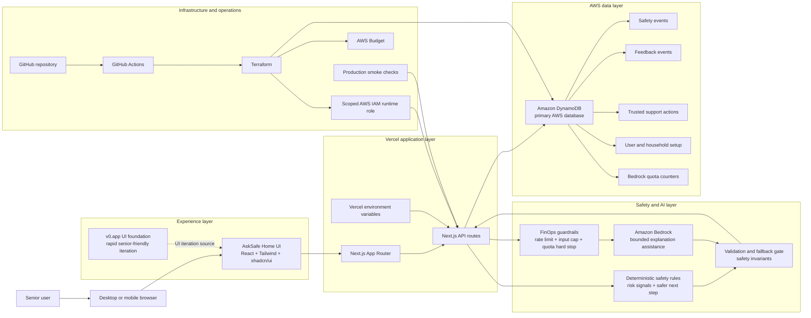

# H0 Architecture Diagram

Use this document as the source content for the final architecture diagram and
submission description.

## Diagram Description

AskSafe Home is a Vercel-hosted Next.js application with a senior-friendly UI
foundation explored through v0.app. The browser sends safety-check requests to
Next.js API routes, where deterministic safety rules create the structured
safety baseline. Amazon Bedrock is used only as bounded explanation assistance:
its output is validated server-side and falls back to deterministic wording if
the model output is unavailable, invalid, or blocked by quota. Amazon DynamoDB
is the primary AWS database for privacy-safe safety events, feedback outcomes,
trusted support actions, user and household setup, and Bedrock quota counters.
Terraform and GitHub Actions manage AWS infrastructure, while FinOps guardrails
such as rate limits, input caps, Bedrock quota hard stops, and AWS Budgets help
control abuse and token cost.

## Mermaid Architecture Diagram

This diagram is suitable for Markdown renderers and can be used as the basis
for a polished image diagram with official icons.



## Icon Version Layout

For the final visual diagram, use the same structure with recognizable icons.

Recommended icons:

- Senior user: person icon
- Browser/mobile: browser or phone icon
- AskSafe UI: React icon or component icon
- v0.app: v0.app icon, v0 wordmark, or small `v0.app` badge
- Vercel: Vercel triangle icon
- Next.js: Next.js icon
- API routes: serverless function icon
- Safety rules: shield/checklist icon
- Amazon Bedrock: AWS Bedrock icon
- Validation/fallback: shield gate icon
- Amazon DynamoDB: AWS DynamoDB icon
- IAM role: AWS IAM or key icon
- Terraform: Terraform icon
- GitHub Actions: GitHub Actions icon
- AWS Budget: cost/budget icon
- FinOps guardrails: custom coin + shield, meter + shield, or cost stop icon
- Smoke checks: checkmark/test icon

If the drawing tool does not provide a FinOps icon, create a simple custom icon
using a coin or dollar mark plus a shield or gauge. The meaning should be cost
control and abuse prevention, not generic finance.

## Short Diagram Caption

```text
AskSafe Home runs on Vercel with Next.js, uses DynamoDB as the primary AWS
database for privacy-safe workflow events, and uses Bedrock only through a
bounded server-side explanation path with validation, fallback, and FinOps
guardrails.
```

## Longer Submission Description

```text
The AskSafe Home architecture separates the senior-friendly product experience
from the safety, AI, data, and infrastructure layers. The frontend is a
Vercel-hosted Next.js app with a v0.app-informed UI foundation. Safety checks
flow through Next.js API routes into deterministic safety rules, with optional
Amazon Bedrock assistance for clearer wording. Bedrock output is validated
before use and can fall back to deterministic results. DynamoDB is the primary
AWS database for privacy-safe safety events, feedback, trusted support actions,
setup data, and Bedrock quota counters. Terraform and GitHub Actions manage AWS
infrastructure, while IAM scoping, rate limits, input caps, quota hard stops,
AWS Budget, and production smoke checks support security, cost control, and
operational readiness.
```

## What The Diagram Must Not Imply

The diagram should not imply that AskSafe:

- stores raw sensitive messages by default
- proves whether a caller, video, or message is real
- performs deepfake detection
- monitors family members
- replaces emergency, legal, financial, medical, or government help
