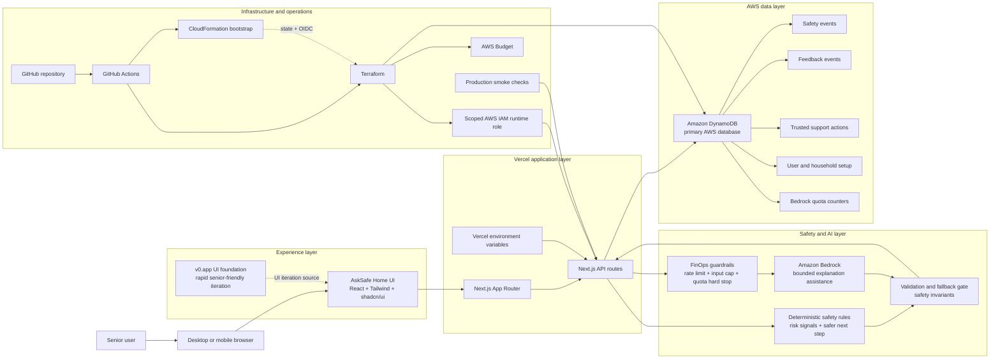

# H0 Architecture Diagram

Use this document as the source content for the final architecture diagram and
submission description.

This submission diagram is derived from the canonical architecture overview in
`docs/architecture/asksafe-home-architecture-overview.md`, the detailed design
notes in `docs/architecture/cloud-ai-foundation-design.md` and
`docs/architecture/bedrock-ai-orchestration-finops-design.md`, and the earlier
H0 target architecture. It is intentionally shorter than those source documents
so it can be used in the final submission and product walkthrough.

## Diagram Description

AskSafe Home is a Vercel-hosted Next.js application with a senior-friendly UI
foundation explored through v0.app. The browser sends safety-check requests to
Next.js API routes, where deterministic safety rules create the structured
safety baseline. Amazon Bedrock is used only as bounded explanation assistance:
its output is validated server-side and falls back to deterministic wording if
the model output is unavailable, invalid, or blocked by quota. Amazon DynamoDB
is the primary AWS database for privacy-safe safety events, feedback outcomes,
trusted support actions, user and household setup, and Bedrock quota counters.
Terraform and GitHub Actions manage AWS infrastructure, while FinOps guardrails
such as rate limits, input caps, Bedrock quota hard stops, and AWS Budgets help
control abuse and token cost.

## Visual Architecture Assets

Presentation-ready SVG and editable source:

- `docs/assets/architecture/asksafe-home-architecture.svg`
- `docs/assets/architecture/asksafe-home-architecture.drawio`
- `docs/assets/architecture/ICON_SOURCES.md`

Use the SVG asset for the Devpost architecture diagram and product walkthrough
video when a rendered image is preferred over Mermaid. Use the `.drawio` file as
the editable source for diagrams.net / draw.io revisions. The diagram uses selected
official AWS Architecture Icons for AWS services, sourced brand SVG icons for
major non-AWS platforms, and a custom FinOps cost guardrail cue.

## Mermaid Architecture Diagram

This diagram is suitable for Markdown renderers and can be used as the basis
for a polished image diagram with official icons.



## Controlled Safety Workflow Detail

The polished diagram can show the workflow as one grouped component, but the
source architecture includes these controlled workflow roles:

- Context Collector: normalizes user text, voice transcript, category, and
  action chips.
- Action Classifier: identifies whether the other party wants the user to pay,
  click, share a code, install an app, share a screen, give details, call back,
  or clarify.
- Knowledge Retriever: uses trusted local scam-safety patterns and official
  guidance seeds.
- Deterministic Safety Reasoner: owns risk level, risk signals, safer next
  step, hold-off actions, and verification steps.
- Response Composer: turns the structured result into calm senior-friendly
  wording, optionally with bounded Bedrock assistance.
- Event Recorder: writes privacy-safe metadata and outcomes to DynamoDB.
- Trusted Support Coordinator: handles user-controlled support actions without
  automatic monitoring or alerts.

Recommended compact diagram label:

```text
Controlled safety workflow
collector -> action classifier -> trusted patterns -> deterministic reasoner -> response composer -> event recorder
```

## Icon Version Layout

For the final visual diagram, use the same structure with recognizable icons.

Recommended icons and asset sources:

- Senior user: person icon
- Browser/mobile: browser or phone icon
- AskSafe UI: React icon or component icon
- v0.app: sourced v0 SVG icon plus `v0.app` label
- Vercel: sourced Vercel SVG icon
- Next.js: sourced Next.js SVG icon
- API routes: serverless function icon
- Safety rules: shield/checklist icon
- Amazon Bedrock: AWS Bedrock icon
- Validation/fallback: shield gate icon
- Amazon DynamoDB: AWS DynamoDB icon
- IAM role: AWS IAM or key icon
- CloudFormation: AWS CloudFormation icon
- Terraform: sourced Terraform SVG icon
- GitHub Actions: sourced GitHub Actions SVG icon
- AWS Budget: cost/budget icon
- FinOps guardrails: custom coin + shield, meter + shield, or cost stop icon
- Smoke checks: checkmark/test icon

The checked-in SVG uses official AWS Architecture Icons for AWS services, sourced Simple Icons SVGs for Vercel, Next.js, GitHub Actions, Terraform, and v0, and a custom FinOps cost guardrail cue. If another drawing tool does not provide a FinOps icon, create a simple custom icon using a coin or dollar mark plus a shield or gauge. The meaning should be cost control and abuse prevention, not generic finance.

## Short Diagram Caption

```text
AskSafe Home runs on Vercel with Next.js, uses DynamoDB as the primary AWS
database for privacy-safe workflow events, and uses Bedrock only through a
bounded server-side explanation path with validation, fallback, and FinOps
guardrails.
```

## Longer Submission Description

```text
The AskSafe Home architecture separates the senior-friendly product experience
from the safety, AI, data, and infrastructure layers. The frontend is a
Vercel-hosted Next.js app with a v0.app-informed UI foundation. Safety checks
flow through Next.js API routes into deterministic safety rules, with optional
Amazon Bedrock assistance for clearer wording. Bedrock output is validated
before use and can fall back to deterministic results. DynamoDB is the primary
AWS database for privacy-safe safety events, feedback, trusted support actions,
setup data, and Bedrock quota counters. CloudFormation bootstraps Terraform
state and GitHub OIDC access; Terraform and GitHub Actions manage AWS app
infrastructure, while IAM scoping, rate limits, input caps, quota hard stops,
AWS Budget, and production smoke checks support security, cost control, and
operational readiness.
```

## What The Diagram Must Not Imply

The diagram should not imply that AskSafe:

- stores raw sensitive messages by default
- proves whether a caller, video, or message is real
- performs deepfake detection
- monitors family members
- replaces emergency, legal, financial, medical, or government help
